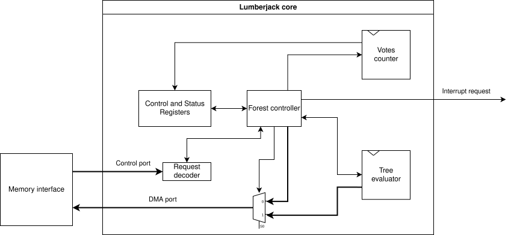

# Lumberjack

## A hardware acceleration framework for random forests

# Getting started

## Dependencies

This project is written in [Veryl](https://veryl-lang.org). It is a modern hardware description language, which compiles down to SystemVerilog.

### Building

To build the project, you will need:

* The [Veryl toolchain](https://veryl-lang.org/install/)

### Simulating

Additionally, to run the simulations and tests, you will need:

* [Verilator](https://verilator.org/guide/latest/install.html)
* [Cocotb](https://docs.cocotb.org/en/stable/install.html)

To view the simulation waveforms, we recommend [surfer](https://gitlab.com/surfer-project/surfer). It is also offered as [a webapp](https://app.surfer-project.org/). [gtkwave](https://github.com/gtkwave/gtkwave) is also a good option.

Finally, we also include a `Justfile` with pre-written commands. You can install [Just](https://github.com/casey/just) to make use of these commands. This is entirely
optional, and is simply included for a better developer experience. In particular, you can run:

```sh
just test forest_top # To run a specific test (check available tests in src/tests)
just test-all # To run all tests
```

Otherwise, to run all tests, use:

```sh
veryl test --wave --quiet
```

The waveform outputs are available in `target/waveform`.

**Note**: We highly recommend using a Linux distribution to build/simulate. Builds and simulations remain untested on other operating systems. In particular,
if using Windows, we recommend using [WSL](https://learn.microsoft.com/en-us/windows/wsl/install). Dependencies should preferably be installed with your
distribution's package manager.

## WIP: Docker image

Alternatively, you can use the pre-built Docker image that includes the toolchain needed to build/simulate the project (not yet available).

# Design and Architecture

The random forest (RF) evaluator is comprised of three main blocks: the tree evaluator, which evaluates a single tree in the forest, the forest evaluator, which schedules
the tree evaluator, and the interface block, which presents control and status registers (CSRs) via a standard, memory-mapped interface. It natively supports the Wishbone
Pipelined protocol, as described in the [Wishbone B4 specification](https://cdn.opencores.org/downloads/wbspec_b4.pdf).

The core has two memory ports: one slave port, called the Control port, which exposes the CSRs to the system, as well as one master port, called the DMA port, which is
used to fetch the forest's nodes from the system's memory.

|  |
|:--:| 
| *General core architecture* |

# Integration

## Forest model memory format

The RF evaluator uses a variation of the memory representation described in \[1\]. The `forest-optimizer` tool ([available on Github](https://github.com/L-tips/embedded-random-forest/)) can be used to convert random forests to the format expected by this core.

**TODO**: Full forest layout, including header

**TODO**: Header layout

|  |
|:--:| 
| *Layout of a node (bytes)* |

|  |
|:--:| 
| *Layout of the IDX field (bits)* |

## Integrating Lumberjack to an existing design

An example integration to the [Ibex core](https://github.com/lowRISC/ibex) can be found here: https://github.com/L-tips/ibex-demo-system/tree/lumberjack-peripheral. Note that we offer protocol converters between the native Ibex memory Wishbone pipelined interconnects in the `src/ibex_bus` directory. For integration on simple systems which do not include a multi-master memory bus arbiter, we also offer a self-arbiter module (`src/self_arbiter.veryl`), which can be used to manage bus access between the Control and DMA ports. The self-arbiter always gives priority to the Control port.

The core can be imported as a native Veryl library (preferred), or as a FuseSOC core. If using FuseSOC, an intermediate, manual (for now) build step is necessary to compile the Veryl source into generated SystemVerilog.

## Software integration

We offer an SVD specification of the CSR map, which can be used to automatically generate software bindings. See `lumberjack_peripheral.svd`.

## Register map

| Offset | Name          | Description                                 | Access      | Reset Value  |
|--------|--------------|---------------------------------------------|-------------|--------------|
| 0x0000 | CTRL         | Control and status                          | RW / RO     | 0x0000_0000  |
| 0x0004 | CTRL_SET     | Set individual bits of CTRL                 | RW / RO     | 0x0000_0000  |
| 0x0008 | CTRL_CLR     | Clear individual bits of CTRL               | RW / RO     | 0x0000_0000  |
| 0x000C | NUM_TREES    | Number of trees in forest                   | RW          | 0x0000_0000  |
| 0x0010 | FOREST_START | Address of first node in the forest         | RW          | 0x0000_0000  |
| 0x0014 | NUM_FEATURES | Number of features in forest                | RW          | 0x0000_0000  |
| 0x0018 | FEATURES_START | Address of first feature for prediction   | RW          | 0x0000_0000  |
| 0x001C | PREDICTION   | Predicted class                             | RO          | 0x0000_0000  |
| 0x0020 | VOTES        | Number of votes for predicted class         | RO          | 0x0000_0000  |
| 0x0024 | INTEN_SET    | Set bits of interrupt enable register       | RW          | 0x0000_0000  |
| 0x0028 | INTEN_CLR    | Clear bits of interrupt enable register     | RW          | 0x0000_0000  |
| 0x002C | INTFLAG      | Interrupt flags                             | RW          | 0x0000_0000  |
| 0x0030 | PERF         | Performance statistics                      | RO          | 0x0000_0000  |

## Register Details

### CTRL (0x0000) – Control and status
```
31                  2   1     0
+--------------------+------+----+
|        Reserved    | BUSY | EN |
+--------------------+------+----+
```
- **0 EN (RW):** Accelerator enable  
  - 0: Accelerator disabled  
  - 1: Accelerator enabled  
- **1 BUSY (RO):** Accelerator busy status  
  - 0: Accelerator idle  
  - 1: Accelerator busy  

---

### CTRL_SET (0x0004) – Set bits in CTRL
```
31                  2   1     0
+--------------------+---- -+----+
|        Reserved    | BUSY | EN |
+--------------------+---- -+----+
```
- **0 EN (RW):** Writing 1 sets the Accelerator Enable bit (enables accelerator). Writing 0 has no effect.
- **1 BUSY (RO):** Accelerator busy status (read-only)

---

### CTRL_CLR (0x0008) – Clear bits in CTRL
```
31                  2   1     0
+--------------------+---- -+----+
|        Reserved    | BUSY | EN |
+--------------------+---- -+----+
```
- **0 EN (RW):** Writing 1 clears the Accelerator Enable bit (disables accelerator). Writing 0 has no effect
- **1 BUSY (RO):** Accelerator busy status (read-only)

---

### NUM_TREES (0x000C)
```
31                             0
+--------------------------------+
|              NUM               |
+--------------------------------+
```
- **[31:0] NUM (RW):** Number of trees in forest

---

### FOREST_START (0x0010)
```
31                             0
+--------------------------------+
|             ADDR               |
+--------------------------------+
```
- **[31:0] ADDR (RW):** Address of the first node in the forest

---

### NUM_FEATURES (0x0014)
```
31                             0
+--------------------------------+
|              NUM               |
+--------------------------------+
```
- **[31:0] NUM (RW):** Number of features in the forest

---

### FEATURES_START (0x0018)
```
31                             0
+--------------------------------+
|             ADDR               |
+--------------------------------+
```
- **[31:0] ADDR (RW):** Address of the first feature used for prediction

---

### PREDICTION (0x001C)
```
31                             0
+--------------------------------+
|             CLASS              |
+--------------------------------+
```
- **[31:0] CLASS (RO):** Predicted class

---

### VOTES (0x0020)
```
31                             0
+--------------------------------+
|              NUM               |
+--------------------------------+
```
- **[31:0] NUM (RO):** Votes for the predicted class

---

### INTEN_SET (0x0024)
```
31                 2   1     0
+-------------------+-----+-----+
|     Reserved      | ERR | RDY |
+-------------------+-----+-----+
```
- **0 READY (RW):** Writing 1 sets the Ready Interrupt Enable bit (enables the interrupt). Writing 0 has no effect.
- **1 ERROR (RW):** Writing 1 sets the Error Interrupt Enable bit (enables the interrupt). Writing 0 has no effect.

---

### INTEN_CLR (0x0028)
```
31                 2   1     0
+-------------------+-----+-----+
|     Reserved      | ERR | RDY |
+-------------------+-----+-----+
```
- **0 READY (RW):** Writing 1 clears the Ready Interrupt Enable bit (disables the interrupt). Writing 0 has no effect.
- **1 ERROR (RW):** Writing 1 clears the Error Interrupt Enable bit (disables the interrupt). Writing 0 has no effect.

---

### INTFLAG (0x002C)
```
31                 2   1     0
+-------------------+-----+-----+
|     Reserved      | ERR | RDY |
+-------------------+-----+-----+
```
- **0 READY (RW):** Ready interrupt flag. This flag is set when a classification is completed.
  This flag is cleared when reading the PREDICTION register.
  Writing a zero to this bit has no effect.
  Writing a one to this bit will clear the flag.
- **1 ERROR (RW):** Error interrupt flag. This flag is set when any error is detected.
  Writing a zero to this bit has no effect.
  Writing a one to this bit will clear the flag.

---

### PERF (0x0030)
```
31                             0
+--------------------------------+
|            CYCCNT              |
+--------------------------------+
```
- **[31:0] CYCCNT (RO):** Cycle count for the last prediction.


## Optimization

Note that this project is still a work-in-progress, and is expected to evolve over time. As the project evolves and is optimized further breaking changes may (read: will) occur to the interfaces exposed by the core, the expected forest memory representation, and more.

# References

\[1\] J. Beaurivage, M. A. Ouameur, and F. Domingue, "A Memory Representation of Random Forests Optimized for Resource-Limited Embedded Devices," IEEE Embedded Systems Letters, pp. 1–1, 2025, doi: [10.1109/LES.2025.3574563](https://doi.org/10.1109/LES.2025.3574563).